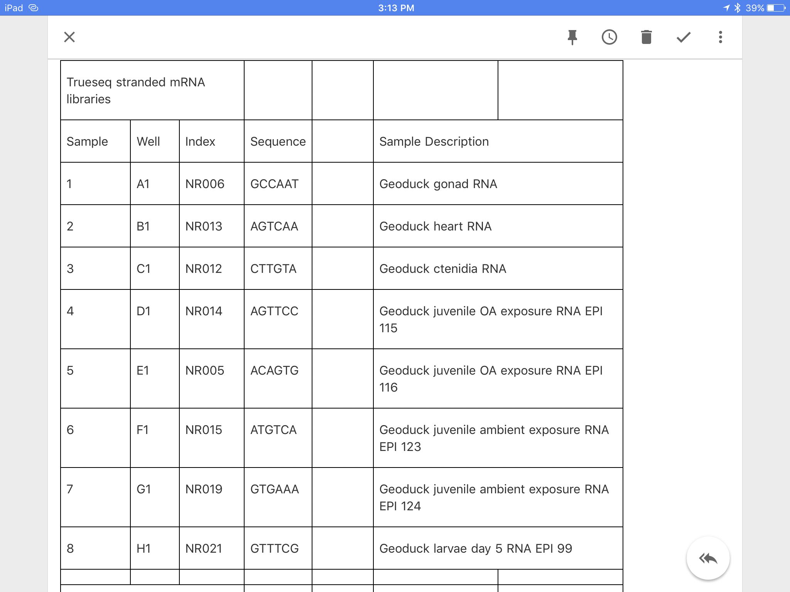
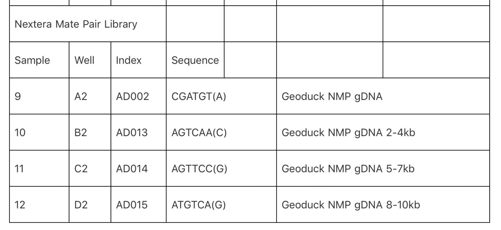

Exploring RNA-Seq data from Illumina effort

Here is what Sam sent

```
The 12 samples will be used for RNAseq for genome annotation – numbers indicate desired sequencing priority.

Juvenile and larval samples were from Hollie Putnam (see links below for more info).

Other tissue was from a single, adult geoduck, collected by Brent & Steven on 20150811.

Gonad
Heart
Ctenidia
Juvenile OA exposure (super low)  (EPI_115, EPI_116)
Juvenile ambient exposure (ambient treatment) (EPI_123, EPI_124)
Larvae day 0 (EPI_74, EPI_75)
Larvae day 5 (EPI_99)
Crystalline style
Byssus gland
Mantle
Labial palps
Juvenile OA exposure – low treatment (EPI_107, EPI_108)
```





---
Larval Files

```
http://owl.fish.washington.edu/nightingales/Geoduck_NovaSeq/170630_A00104_0125_BH2V37DMXX/Demux/FastqOutput/L001/NR021/NR021_S8_L001_R1_001.fastq.gz

http://owl.fish.washington.edu/nightingales/Geoduck_NovaSeq/170630_A00104_0125_BH2V37DMXX/Demux/FastqOutput/L001/NR021/NR021_S8_L001_R2_001.fastq.gz

http://owl.fish.washington.edu/nightingales/Geoduck_NovaSeq/170630_A00104_0125_BH2V37DMXX/Demux/FastqOutput/L002/NR021/NR021_S8_L002_R1_001.fastq.gz

http://owl.fish.washington.edu/nightingales/Geoduck_NovaSeq/170630_A00104_0125_BH2V37DMXX/Demux/FastqOutput/L002/NR021/NR021_S8_L002_R2_001.fastq.gz
```

These seem to be same library (PE ???) split over two lanes.

NovaSeq run for all combined.  The MP libraries have a 800 bp insert and the RNA Seq libraries have a 300bp insert so they were loaded in a 10:1 MP:RNA into the NovaSeq.

---

Will attempt Trinity with larval samples- maybe Hyak...
Guidance...
https://genefish.wordpress.com/?s=Trinity


