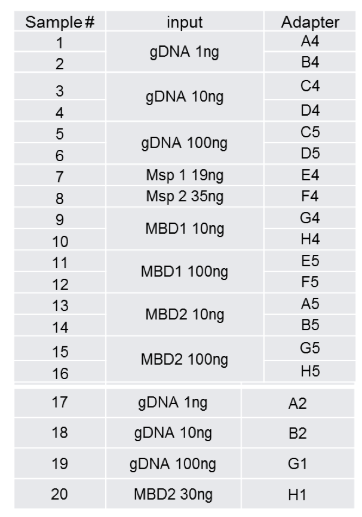

Here are data corresponding to different types of library preparation.



=======

```
10_32_S32_L001_R1_001.fastq.gz 29M
11_37_S37_L001_R1_001.fastq.gz 35M
12_38_S38_L001_R1_001.fastq.gz 43M
13_33_S33_L001_R1_001.fastq.gz 32M
14_34_S34_L001_R1_001.fastq.gz 34M
15_39_S39_L001_R1_001.fastq.gz 33M
16_40_S40_L001_R1_001.fastq.gz 38M
17_9_S9_L001_R1_001.fastq.gz 20M
18_10_S10_L001_R1_001.fastq.gz 26M
19_7_S7_L001_R1_001.fastq.gz 18M
1_25_S25_L001_R1_001.fastq.gz 25M
20_8_S8_L001_R1_001.fastq.gz 16M
2_26_S26_L001_R1_001.fastq.gz 8.7M
3_27_S27_L001_R1_001.fastq.gz 12M
4_28_S28_L001_R1_001.fastq.gz 14M
5_35_S35_L001_R1_001.fastq.gz 1.1M
6_36_S36_L001_R1_001.fastq.gz 1.6M
7_29_S29_L001_R1_001.fastq.gz 30M
8_30_S30_L001_R1_001.fastq.gz 32M
9_31_S31_L001_R1_001.fastq.gz 30M
```


In terms of number of mapped reads.      
(Seems a bit low)

```
Output file: /Volumes/Serine/wd/18-03-14/10_32_S32_L001-bsmap_out_Cv3.sam	 (format: SAM)
pairs:       81447 (14%)
Output file: /Volumes/Serine/wd/18-03-14/11_37_S37_L001-bsmap_out_Cv3.sam	 (format: SAM)
pairs:       67733 (9.7%)
Output file: /Volumes/Serine/wd/18-03-14/12_38_S38_L001-bsmap_out_Cv3.sam	 (format: SAM)
pairs:       79251 (9.2%)
Output file: /Volumes/Serine/wd/18-03-14/13_33_S33_L001-bsmap_out_Cv3.sam	 (format: SAM)
pairs:       107092 (17%)
Output file: /Volumes/Serine/wd/18-03-14/14_34_S34_L001-bsmap_out_Cv3.sam	 (format: SAM)
pairs:       129237 (19%)
Output file: /Volumes/Serine/wd/18-03-14/15_39_S39_L001-bsmap_out_Cv3.sam	 (format: SAM)
pairs:       70160 (10%)
Output file: /Volumes/Serine/wd/18-03-14/16_40_S40_L001-bsmap_out_Cv3.sam	 (format: SAM)
pairs:       87678 (11%)
Output file: /Volumes/Serine/wd/18-03-14/17_9_S9_L001-bsmap_out_Cv3.sam	 (format: SAM)
pairs:       26451 (6.5%)
Output file: /Volumes/Serine/wd/18-03-14/18_10_S10_L001-bsmap_out_Cv3.sam	 (format: SAM)
pairs:       70674 (13%)
Output file: /Volumes/Serine/wd/18-03-14/19_7_S7_L001-bsmap_out_Cv3.sam	 (format: SAM)
pairs:       42329 (11%)
Output file: /Volumes/Serine/wd/18-03-14/1_25_S25_L001-bsmap_out_Cv3.sam	 (format: SAM)
pairs:       32748 (6.7%)
Output file: /Volumes/Serine/wd/18-03-14/20_8_S8_L001-bsmap_out_Cv3.sam	 (format: SAM)
pairs:       52351 (17%)
Output file: /Volumes/Serine/wd/18-03-14/2_26_S26_L001-bsmap_out_Cv3.sam	 (format: SAM)
pairs:       6805 (4%)
Output file: /Volumes/Serine/wd/18-03-14/3_27_S27_L001-bsmap_out_Cv3.sam	 (format: SAM)
pairs:       2185 (0.94%)
Output file: /Volumes/Serine/wd/18-03-14/4_28_S28_L001-bsmap_out_Cv3.sam	 (format: SAM)
pairs:       9393 (3.4%)
Output file: /Volumes/Serine/wd/18-03-14/5_35_S35_L001-bsmap_out_Cv3.sam	 (format: SAM)
pairs:       1244 (5.7%)
Output file: /Volumes/Serine/wd/18-03-14/6_36_S36_L001-bsmap_out_Cv3.sam	 (format: SAM)
pairs:       1860 (5.9%)
Output file: /Volumes/Serine/wd/18-03-14/7_29_S29_L001-bsmap_out_Cv3.sam	 (format: SAM)
pairs:       112769 (18%)
Output file: /Volumes/Serine/wd/18-03-14/9_31_S31_L001-bsmap_out_Cv3.sam	 (format: SAM)
pairs:       101817 (17%)
```

Then to determine the number of loci that have at least 3x coverage

```
   12997 methratio-out10_32_S32.txt.2.igv
   19176 methratio-out11_37_S37.txt.2.igv
   31743 methratio-out12_38_S38.txt.2.igv
   16819 methratio-out13_33_S33.txt.2.igv
   23661 methratio-out14_34_S34.txt.2.igv
   20104 methratio-out15_39_S39.txt.2.igv
   24650 methratio-out16_40_S40.txt.2.igv
     143 methratio-out17_9_S9.txt.2.igv
     640 methratio-out18_10_S10.txt.2.igv
     410 methratio-out19_7_S7.txt.2.igv
    2528 methratio-out1_25_S25.txt.2.igv
    2828 methratio-out20_8_S8.txt.2.igv
      31 methratio-out2_26_S26.txt.2.igv
     114 methratio-out3_27_S27.txt.2.igv
      90 methratio-out4_28_S28.txt.2.igv
       0 methratio-out5_35_S35.txt.2.igv
       0 methratio-out6_36_S36.txt.2.igv
   37096 methratio-out7_29_S29.txt.2.igv
   ```