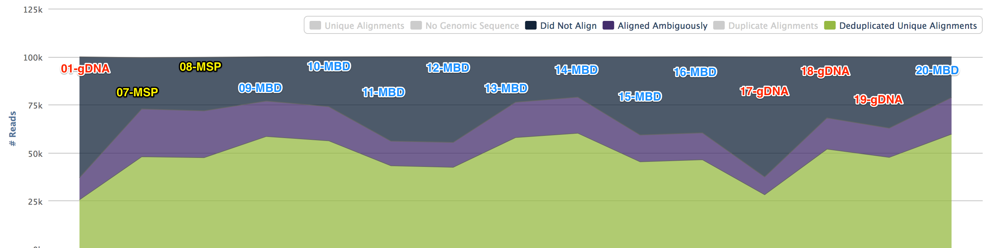
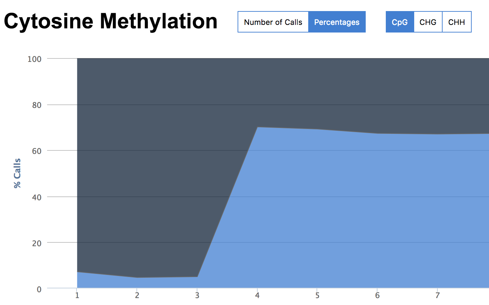
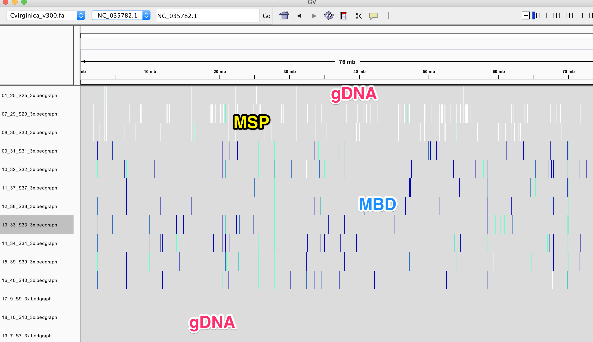

We took DNA from a single Eastern oyster and prepped using MBD, MSP digestion, and plain old DNA. Full details can be found [here](http://onsnetwork.org/kubu4/2018/01/16/samples-submitted-c-virginica-gdna-mbd-and-mspi-to-qiagen/).


Five samples were sent to Qiagen for library prep and sequencing.
```
gDNA C.virginica – Genomic DNA, 20uL, 58.4ng/uL
MBD 1 virginica – Fragmented (~400bp average size), MBD-enriched, 25uL, 18.3ng/uL
MBD 2 virginica – Fragmented (~400bp average size), MBD-enriched, 25uL, 19.6ng/uL
MspI 1 virginica – gDNA digested with MspI, 25uL, 53.4ng/uL
MspI 2 virginica – gDNA digested with MspI, 25uL, 31.0ng/uL
```

From this, 20 preps were made.


With QC on these files [available](http://gannet.fish.washington.edu/seashell/bu-serine-wd/18-03-14/multiqc_report.html).



Some libraries had a low output and were dropped. To do a comparison [Bismark was performed looking at 100k reads](https://github.com/sr320/nb-2018/blob/master/C_virginica/45-Qiagen-more-pretty.ipynb).

The gDNA and MSP libraries had methylation calls (no filters) at about 7% whereas the MBD libraries hit at about 70%.



None of this is too surprising. What is of most interest is for any given loci (CpG), what is the coverage and where are the loci. As for coverage given 100k reads...

**Library**  |  **3x**   |  **10x**
---------|--------|-------
01-gDNA	|	 742 	| 17
07-msp | 5153 | 227
08-msp | 3943 | 169
09-MBD | 	1170 | 10
10-MBD | 1037 | 8
11-MBD | 496 | 5
12-MBD | 582 | 7
13-MBD | 873 | 9
14-MBD | 1146 | 22
15-MBD | 807 | 12
16-MBD | 741 | 8
17-gDNA | 27 | 0
18-gDNA | 68 | 0
19-gDNA | 98 | 0
20-MBD | 813 | 8

# IGV



You can play with yourself with loading this session:
```
https://raw.githubusercontent.com/sr320/nb-2018/master/C_virginica/igv/Qiagen-0915-igv_session.xml
```


There a few more questions that could be tackled. Post in the comments if something comes to mind.
